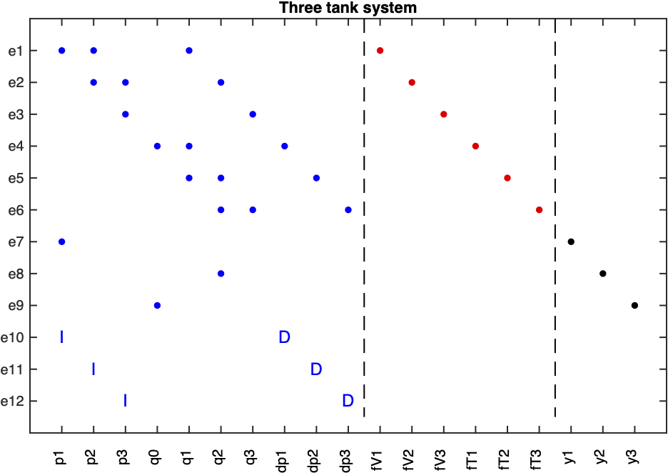

Basic Usage
===========

This toolbox covers a set of methods and functionality for fault diagnosis of dynamic systems described by differential (or static) equations. 
The field of fault diagnosis is wide and there are many available methods described in the literature. This toolbox focuses on techniques from the Automatic Control community (Safeprocess) and some from the logic field (DX).
In particular, techniques related to *structural analysis* is covered because they are particularly suited to automate in a computer tool. 

This manual is for the python version of the toolbox, see https://faultdiagnosistoolbox.github.io for more information on the corresponding Matlab version of the toolbox.

Installation
------------

The toolbox is available as a binary distribution on PyPI and can be installed dirctly using pip::

    % pip install faultdiagnosistoolbox

The package is a binary distribution and should work on Windows, Mac, and Linux with a current Python version. See https://pypi.org/project/faultdiagnosistoolbox/ for currently available Python versions.

Defining models
---------------

.. image:: images/Three_Tanks.png
   :width: 55%
   :align: right

A three-tank example will be used as a running example, highlighting functionality of the toolbox. The system consists of three coupled tanks, some sensors, and a controllable inflow. The tanks are connected in series and the flow between the tanks is controlled by the valves. 

A simple model of the system can be described by the following equations:

.. math::

    \begin{align*} 
        e_1&: q_1 = \frac{1}{R_{V1}} (p_1 - p_2) &    e_{7}&: y_{1} = p_1 \\
        e_2&: q_2 = \frac{1}{R_{V2}} (p_2 - p_3) &      e_{8}&: y_{2} = q_2 \\
        e_3&: q_3 = \frac{1}{R_{V3}} (p_3) &       e_{9}&: y_{3} = q_0 \\
        e_4&: \dot{p}_1 = \frac{1}{C_{T1}} (q_0 - q_1) & e_{10}&:
        \dot{p}_1 = \frac{dp_1}{dt} \\
        e_5&: \dot{p}_2 = \frac{1}{C_{T2}} (q_1 - q_2) & e_{11}&: \dot{p}_2 = \frac{dp_2}{dt}\\
        e_{6}&: \dot{p}_3 = \frac{1}{C_{T3}} (q_2 - q_3) & e_{12}&: \dot{p}_3 = \frac{dp_3}{dt}
    \end{align*}

where :math:`p_i` is the pressure in tank :math:`i`, :math:`q_{i}` the flow through valve :math:`i`, :math:`R_{Vi}` the flow resistance of valve :math:`i`, and :math:`C_{Ti}` the capacitance of tank :math:`i`. Three sensors :math:`y_{i}` measure :math:`p_{1}`, :math:`q_{2}`, and :math:`q_{0}`, respectively. 
For this example, six parametric faults have been considered in the plant: change in capacity of tanks and partial blocks in the valves.

The definition of this model is done by specifying a dictionary with all model specifications. First, define `type` (here only `Symbolic` models are illustrated), unknown variables `x`, fault variables `f`, known variables `z`, and parameters `parameters`. 

.. code-block:: python

    import faultdiagnosistoolbox as fdt
    modelDef = {}
    modelDef['type'] = 'Symbolic'
    modelDef['x'] = ['p1', 'p2', 'p3', 'q0', 'q1', 'q2', 'q3', 'dp1', 'dp2', 'dp3']
    modelDef['f'] = ['fV1', 'fV2', 'fV3', 'fT1', 'fT2', 'fT3']
    modelDef['z'] = ['y1', 'y2', 'y3']
    modelDef['parameters'] = ['Rv1', 'Rv2', 'Rv3', 'CT1', 'CT2', 'CT3']

Then, create the symbolic variables using `Sympy <https://www.sympy.org/en/index.html>`_ as

.. code-block:: python

    p1, p2, p3, q0, q1, q2, q3, dp1, dp2, dp3 = sym.symbols(modelDef['x'])
    fV1, fV2, fV3, fT1, fT2, fT3 = sym.symbols(modelDef['f'])
    y1, y2, y3 = sym.symbols(modelDef['z'])
    Rv1, Rv2, Rv3, CT1, CT2, CT3 = sym.symbols(modelDef['parameters'])

and then define the model equations in the `rels` key as

.. code-block:: python

    modelDef['rels'] = [
        -q1 + 1 / Rv1 * (p1 - p2) + fV1,
        -q2 + 1 / Rv2 * (p2 - p3) + fV2,
        -q3 + 1 / Rv3 * p3 + fV3,
        -dp1 + 1 / CT1 * (q0 - q1) + fT1,
        -dp2 + 1 / CT2 * (q1 - q2) + fT2,
        -dp3 + 1 / CT3 * (q2 - q3) + fT3,
        -y1 + p1,
        -y2 + q2,
        -y3 + q0,
        fdt.DiffConstraint('dp1', 'p1'),
        fdt.DiffConstraint('dp2', 'p2'),
        fdt.DiffConstraint('dp3', 'p3')]

When using standard functions, use SymPy functions like ``sym.sin`` or ``sym.exp`` when defining the equations. Note how extra variables are introduced for dynamic variables, and then a differential constraint

.. math::

    \dot{p}_1 = \frac{dp_1}{dt}

is represented by 

.. code-block:: python

    fdt.DiffConstraint('dp1', 'p1')

Finally, the model object is created by

.. code-block:: python

    model = fdt.DiagnosisModel(modelDef, name='Three tank system')

With a model object, the model structure can be plotted using the command

.. code-block:: python

    model.PlotModel()

that produces the figure

External functions
^^^^^^^^^^^^^^^^^^

It is often the case in more complex models that there are external functions like look-up tables of conditional statements. For example, consider that the model has a function :math:`\text{extfun}(p_1, p_2, \gamma)`. Defining a symbolic function as

.. code-block:: python

    extfun = sym.Function('extfun')

and then the ``extfun`` function can be used as any other when defining your model. Of course, the symbolic toolbox will not be able to do symbolic manipulations of that particular function and the causality of equations using that function will be uniquely determined by the model formulation.

Basic Diagnosability Analysis
-----------------------------

Some text.

Sensor Placement
----------------

Some text.

Residual Generator Design
-------------------------

Some text.
