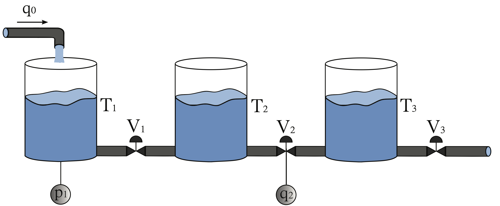
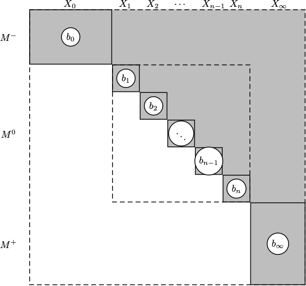
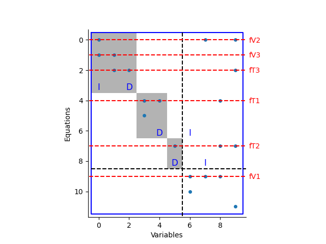
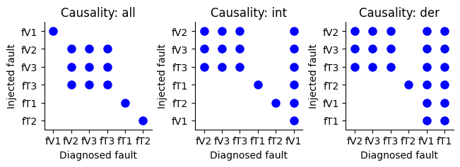

Basic Usage
===========

This toolbox covers a set of methods and functionality for fault diagnosis of dynamic systems described by differential (or static) equations. 
The field of fault diagnosis is wide and there are many available methods described in the literature. This toolbox focuses on techniques from the Automatic Control community (Safeprocess) and some from the logic field (DX).
In particular, techniques related to *structural analysis* is covered because they are particularly suited to automate in a computer tool. 

This manual is for the python version of the toolbox, see https://faultdiagnosistoolbox.github.io for more information on the corresponding Matlab version of the toolbox.

Installation
------------

The toolbox is available as a binary distribution on PyPI and can be installed dirctly using pip::

    % pip install faultdiagnosistoolbox

The package is a binary distribution and should work on Windows, Mac, and Linux with a current Python version. See https://pypi.org/project/faultdiagnosistoolbox/ for currently available Python versions.

Defining models
---------------

A three-tank example will be used as a running example, highlighting functionality of the toolbox. The system consists of three coupled tanks, some sensors, and a controllable inflow. The tanks are connected in series and the flow between the tanks is controlled by the valves. 

A simple model of the system can be described by the following equations:

.. math::

    \begin{align*} 
        e_1&: q_1 = \frac{1}{R_{V1}} (p_1 - p_2) &    e_{7}&: y_{1} = p_1 \\
        e_2&: q_2 = \frac{1}{R_{V2}} (p_2 - p_3) &      e_{8}&: y_{2} = q_2 \\
        e_3&: q_3 = \frac{1}{R_{V3}} (p_3) &       e_{9}&: y_{3} = q_0 \\
        e_4&: \dot{p}_1 = \frac{1}{C_{T1}} (q_0 - q_1) & e_{10}&:
        \dot{p}_1 = \frac{dp_1}{dt} \\
        e_5&: \dot{p}_2 = \frac{1}{C_{T2}} (q_1 - q_2) & e_{11}&: \dot{p}_2 = \frac{dp_2}{dt}\\
        e_{6}&: \dot{p}_3 = \frac{1}{C_{T3}} (q_2 - q_3) & e_{12}&: \dot{p}_3 = \frac{dp_3}{dt}
    \end{align*}

where :math:`p_i` is the pressure in tank :math:`i`, :math:`q_{i}` the flow through valve :math:`i`, :math:`R_{Vi}` the flow resistance of valve :math:`i`, and :math:`C_{Ti}` the capacitance of tank :math:`i`. Three sensors :math:`y_{i}` measure :math:`p_{1}`, :math:`q_{2}`, and :math:`q_{0}`, respectively. 
For this example, six parametric faults have been considered in the plant: change in capacity of tanks and partial blocks in the valves.

The definition of this model is done by specifying a dictionary with all model specifications. First, define `type` (here only `Symbolic` models are illustrated), unknown variables `x`, fault variables `f`, known variables `z`, and parameters `parameters`. 

.. code-block:: python

    import faultdiagnosistoolbox as fdt
    modelDef = {}
    modelDef['type'] = 'Symbolic'
    modelDef['x'] = ['p1', 'p2', 'p3', 'q0', 'q1', 'q2', 'q3', 'dp1', 'dp2', 'dp3']
    modelDef['f'] = ['fV1', 'fV2', 'fV3', 'fT1', 'fT2', 'fT3']
    modelDef['z'] = ['y1', 'y2', 'y3']
    modelDef['parameters'] = ['Rv1', 'Rv2', 'Rv3', 'CT1', 'CT2', 'CT3']

Then, create the symbolic variables using `Sympy <https://www.sympy.org/en/index.html>`_ as

.. code-block:: python

    p1, p2, p3, q0, q1, q2, q3, dp1, dp2, dp3 = sym.symbols(modelDef['x'])
    fV1, fV2, fV3, fT1, fT2, fT3 = sym.symbols(modelDef['f'])
    y1, y2, y3 = sym.symbols(modelDef['z'])
    Rv1, Rv2, Rv3, CT1, CT2, CT3 = sym.symbols(modelDef['parameters'])

and then define the model equations in the `rels` key as

.. code-block:: python

    modelDef['rels'] = [
        -q1 + 1 / Rv1 * (p1 - p2) + fV1,
        -q2 + 1 / Rv2 * (p2 - p3) + fV2,
        -q3 + 1 / Rv3 * p3 + fV3,
        -dp1 + 1 / CT1 * (q0 - q1) + fT1,
        -dp2 + 1 / CT2 * (q1 - q2) + fT2,
        -dp3 + 1 / CT3 * (q2 - q3) + fT3,
        -y1 + p1,
        -y2 + q2,
        -y3 + q0,
        fdt.DiffConstraint('dp1', 'p1'),
        fdt.DiffConstraint('dp2', 'p2'),
        fdt.DiffConstraint('dp3', 'p3')]

When using standard functions, use SymPy functions like ``sym.sin`` or ``sym.exp`` when defining the equations. Note how extra variables are introduced for dynamic variables, and then a differential constraint

.. math::

    \dot{p}_1 = \frac{dp_1}{dt}

is represented by 

.. code-block:: python

    fdt.DiffConstraint('dp1', 'p1')

Finally, the model object is created by

.. code-block:: python

    model = fdt.DiagnosisModel(modelDef, name='Three tank system')

With a model object, basic information about the model can be printes using the ``Lint`` method and the model structure can be plotted using the command

.. code-block:: python

    model.PlotModel()

that produces the figure

.. image:: images/ThreeTankModel.png
   :width: 55%
   :align: center

External functions
^^^^^^^^^^^^^^^^^^

It is often the case in more complex models that there are external functions like look-up tables of conditional statements. For example, consider that the model has a function :math:`\text{extfun}(p_1, p_2, \gamma)`. Defining a symbolic function as

.. code-block:: python

    extfun = sym.Function('extfun')

and then the ``extfun`` function can be used as any other when defining your model. Of course, the symbolic toolbox will not be able to do symbolic manipulations of that particular function and the causality of equations using that function will be uniquely determined by the model formulation.

Basic Diagnosability Analysis
-----------------------------

A set of methods for analyzing diagnosability of a model or a set of residual generators are available. Here, diagnosability means to analyze which faults that are structurally detectable and structurally isolable. Basic definitions on detectability and isolability used in the toolbox can be found in the references

    E. Frisk, A. Bregon, J. Åslund, M. Krysander, B. Pulido, and G. Biswas. "*Diagnosability analysis considering causal interpretations for differential constraints*" (https://doi.org/10.1109/TSMCA.2012.2189877). Systems, Man and Cybernetics, Part A: Systems and Humans, IEEE Transactions on, 42(5):1216-1229, 2012.

    M. Krysander and E. Frisk. "*Sensor placement for fault diagnosis*" (https://doi.org/10.1109/TSMCA.2008.2003968). Systems, Man and Cybernetics, Part A: Systems and Humans, IEEE Transactions on, 38(6):1398-1410, 2008.

For a basic detectability analysis of a given model, use the class method ``DetectabilityAnalysis`` as

.. code-block:: python

    df, ndf = model.DetectabilityAnalysis()

The ``df`` output is the set of detectable faults and ``ndf`` the set of non-detectable faults. In this case it will show that all faults are detectable.

When doing any sorts of structural analysis for fault diagnosis, the Dulmage-Mendelsohn decomposition

    Dulmage, A. L., Mendelsohn, N. S. (1958). "*Coverings of bipartite graphs*". Canadian Journal of Mathematics, 10, 517-534.

is a very useful tool. Given a structural model, by proper and well defined reordering of variables and equations, a structure graph can always be transformed into the form shown in

using the ``GetDMParts`` class method that provides

* ``Mm`` - structure defining the rows and columns of the under-determined part M-
* ``M0`` - cell array with structures defining the Hall components in M0
* ``Mp`` - structure defining the rows and columns of the over-determined part M+
* ``M0eqs`` - collection of all rows in M0
* ``M0vars`` - collection of all columns in M0
* ``rowp`` - original row permutation
* ``colp`` - original column permutation

For fault diagnosis, there is a particular decomposition of the overdetermined part that is of particular interest. The decomposition is defined in 

    Krysander, M., Åslund, J., Nyberg, M. (2007). "*An efficient algorithm for finding minimal overconstrained subsystems for model-based diagnosis*" (https://doi.org/10.1109/TSMCA.2007.909555). IEEE Transactions on Systems, Man, and Cybernetics-Part A: Systems and Humans, 38(1), 197-206.

and can be computed using the ``PSODecomposition`` method.  There is also a class method that can plot the Dulmage-Mendelsohn decomposition of the model structure in an informative way. For this method, there are two options that can be activated, perform the decomposition of the over-determined part of the model, and indicate which equations that are influenced by faults. This is particularly important in diagnosability analysis.

.. code-block:: python

    _ = model.PlotDM(fault=True, eqclass=True)

and the result, for the three-tank model is 

where it can be seen that faults ``fT1``, ``fT2``, and ``fV1`` are uniquely isolable while ``fT3``, ``fV2``, and ``fV3`` are detectable but not isolable from each other.

Isolability analaysis can also be done directly on the model using the class method ``IsolabilityAnalysis``. With no output arguments, the method plots the analysis. It is possible to restrict the analysis to causality assumptions, i.e., derivative, integral, or mixed causality.

.. code-block:: python

    _ = model.IsolabilityAnalysis(ax=ax)
    _ = model.IsolabilityAnalysis(ax=ax, causality="int")
    _ = model.IsolabilityAnalysis(ax=ax, causality="der")

produces the figures 

Sensor Placement
----------------

As shown above, the provided sensors does not uniquely isolable faults and additional sensors are needed. The sensor placement problem is a combinatorial optimization problem that can be solved using the method ``SensorPlacementIsolability``. The method returns a list of sets of sensors that uniquely isolates the faults. The method can also be used to plot the isolability analysis for each sensor set.

.. code-block:: python

    sens, _ = model.SensorPlacementIsolability()
    model_with_new_sensor = model.copy()
    model_with_new_sensor.AddSensors(sens[0])

This will conclude that the flow out of tank 3 ``q3`` is needed to uniquely isolate all faults. Plotting the isolability analysis for a model with extensed sensor set confirms that full (structural) fault isolability is achieved.

MSO, MTES, and Residual Generator Design
----------------------------------------

Minimally Structurally Overdetermined (MSO) sets and Minimally Testable Equation Sets (MTES) are important concepts in fault diagnosis. The MSO sets are sets of equations that are minimal and overdetermined, i.e., the number of equations is larger than the number of variables. The MTES are sets of equations with minimal fault support. For details, see

    Krysander, M., Åslund, J., Nyberg, M. (2007). "*An efficient algorithm for finding minimal overconstrained subsystems for model-based diagnosis*" (https://doi.org/10.1109/TSMCA.2007.909555). IEEE Transactions on Systems, Man, and Cybernetics-Part A: Systems and Humans, 38(1), 197-206.

    Krysander, M., Åslund, J., Frisk, E. (2010). "*A structural algorithm for finding testable sub-models and multiple fault isolability analysis*". In 21st International Workshop on Principles of Diagnosis (DX-10), Portland, Oregon, USA (pp. 17-18).

The sets of equations can be computed using the ``MSO`` and ``MTES`` class methods as
.. code-block:: python

    msos = model.MSO()
    mtes = model.MTES()

In this case there are 6 MSO sets and 5 MTES sets. Here, focus will be on the MSO sets and how to generate residuals. First, it can be useful to filter out MSO sets with low differential index, since these can be realized as a residual generator without the need for numerical differentiation. It is also possible to check obsevability properties of the MSO sets in case an observer approach is pursued. this can be done using the ``IsLowIndex`` and ``IsObservable`` class methods as

.. code-block:: python

    li = [m for m in msos if model.IsLowIndex(m)]
    oi = [m for m in msos if model.IsObservable(m)]

This shows that all MSOs are observable and that 5 out of the 6 MSO sets are low-index. This means that one of the MSO sets can't be used for residual generation without numerical differentiation. This is also the reason why the isolability analysis differs between integral causality and no causality assumption.

Now, all MSO sets are not needed to achieve best (structural) isolability. The method ``TestSelection`` can be used to find sets of MSO sets that cna be used to find residuals. Code below runs the test selection algorithm resulting in 3 required MSOs/residuals. The code also computes the Fault Signature Matrix (FSM) and the corresponding isolability performance of the selected set of MSOs and it can be verified that isolation performance equals the initial isolability analysis using integral causality.

.. code-block:: python

    ts = model.TestSelection(li)
    ts_msos = [li[ts_i] for ts_i in ts]
    FSM = model.FSM(model.FSM(ts_msos))
    model.IsolabilityAnalysisFSM(FSM)

Now, to generate residual generator code, let's consider the first low_index MSO set ``ts_msos[0]``. The objective is to choose one equations a redundanrt/residual equation and use the rest to compute all unknown variables. 

.. code-block:: python

    mso = ts_msos[0]
    print(mso)
    model.MSOCausalitySweep(mso)

    >> [ 7  6  4 10  3  8  9  0]
    
The method ``MSOCausalitySweep`` can be used to identify which of these equations that can be used as a residual equation that lead to non-differential causality

.. code-block:: python

    model.MSOCausalitySweep(mso)

    >> ['der', 'int', 'der', 'mixed', 'mixed', 'mixed', 'int', 'mixed']

This means that selecting 2nd or 7th equation as a residual equation will lead to a residual generator with no differential causality. Here, let's choose the second equation ``(model.syme[6])`` corresponding to 

.. math::

    e_7: y_1 = p_1

The residual generator can be generated using the ``Gamma`` method to compute a matching and the ``SeqResGen`` method to generate code. In this case, python code is generated but it is also possible to generate C-code.

**NOTE** This part of the toolbox is highly experimental and non-tested. It might work and it might not.

.. code-block:: python

    res = mso[1]  # y1 = p1
    M0 = [ei for ei in mso if ei != res]
    Gamma = model.Matching(M0)

    model.SeqResGen(Gamma, res, "residual")

The core part of the generated python file looks like below, where the pressures ``p1`` and ``p2`` are states and updated using a simple Euler-forward integrator.

.. code-block:: python

        # Known signals
        y1 = z[0]
        y2 = z[1]
        y3 = z[2]

        # Initialize state variables
        p1 = state["p1"]
        p2 = state["p2"]

        # Residual generator body
        q2 = y2  # e8
        q0 = y3  # e9
        q1 = (p1 - p2) / Rv1  # e1
        dp1 = (q0 - q1) / CT1  # e4
        dp2 = (q1 - q2) / CT2  # e5

        r = p1 - y1  # e7

        # Update integrator variables
        p1 = ApproxInt(dp1, state["p1"], Ts)  # e10
        p2 = ApproxInt(dp2, state["p2"], Ts)  # e11

        # Update state variables
        state["p1"] = p1
        state["p2"] = p2
